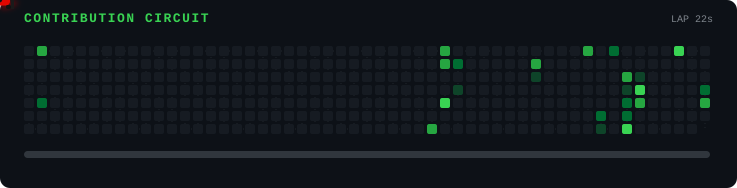

# F1 Contribution Track — setup

This renders an animated F1 car racing across your real GitHub contribution
grid, as an SVG you embed in your profile README. It updates itself daily
via a GitHub Action.

## 1. Add these files to your `BlazeO8/BlazeO8` profile repo
Copy `generate.js`, `package.json`, and `.github/workflows/f1-track.yml`
into the root of that repo. Keep the folder structure — the workflow file
must stay at `.github/workflows/f1-track.yml`.

## 2. Create a Personal Access Token (PAT)
The contribution graph requires a token with `read:user` scope (the default
`GITHUB_TOKEN` Actions provides doesn't have this).

- Go to GitHub → Settings → Developer settings → Personal access tokens →
  Tokens (classic) → Generate new token
- Scope needed: `read:user`
- Copy the token

## 3. Add it as a repo secret
- In `BlazeO8/BlazeO8` → Settings → Secrets and variables → Actions →
  New repository secret
- Name: `GH_PAT`
- Value: the token you just made

## 4. Run it once manually
- Go to the Actions tab → "Update F1 Contribution Track" → Run workflow
- This generates `dist/f1-track-dark.svg` and `dist/f1-track-light.svg`
  and commits them to the repo

## 5. Embed it in your README
```md
<picture>
  <source media="(prefers-color-scheme: dark)" srcset="./dist/f1-track-dark.svg">
  <source media="(prefers-color-scheme: light)" srcset="./dist/f1-track-light.svg">
  
</picture>
```

After that, it regenerates automatically every day at midnight UTC, so the
car's track always reflects your latest contributions.
